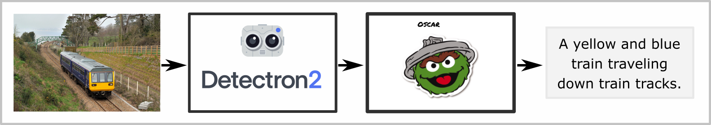

# Image captioning pipeline based on Oscar

This repository contains source codes I used in my master thesis Image Captioning using Deep Learning. 

## Captioning pipeline



The work consits of creating the image captioning pipeline based on the existing method [Oscar](https://github.com/microsoft/Oscar). Its input requires the features of the detected objects in the image. For this purpose I used detection architecture Faster-R-CNN implemented in framework [Detectron2](https://github.com/facebookresearch/detectron2). In order to obtain the correct structure that is needed on the input of Oscar, I modified the Detectron2 codes. They can be found on my [fork](https://github.com/zeleznyt/detectron2).

### Installation

In the pipeline, I use two separate environments for each, Detectron2 and Oscar. The builds can be found in appropriate repositories:
* [Detectron2](https://github.com/zeleznyt/detectron2/blob/main/INSTALL.md)
* [Oscar](https://github.com/microsoft/Oscar/blob/master/INSTALL.md)

### Dataset

In my work, I use [COCO 2017](https://cocodataset.org/#download) dataset to finetune Oscar on downstream task of image captioning.

### Building the dataset of features

The images from COCO dataset are processed by the Faster-R-CNN detector. It generates the data structure, which is then used as Oscar's input. To build this structure, use following script:
```
conda activate detectron2
cd /detectron2
python demo/demo2.py --config-file configs/COCO-Detection/faster_rcnn_R_50_C4_3x.yaml --confidence-threshold 0.2 --input-path /input/dataset/train2017 --output-features /output/datasets/coco_caption --coco-classnames /input/ms_coco_classnames.txt --id-dictionary /input/id_dictionary.txt --opts MODEL.WEIGHTS detectron2://COCO-Detection/faster_rcnn_R_50_C4_3x/137849393/model_final_f97cb7.pkl
```
The required files can be required as follows: 
* `config-file`:  Provided by [Detectron MODEL_ZOO](https://github.com/zeleznyt/detectron2/blob/main/MODEL_ZOO.md).
* `coco-classnames`: Provided in my [Detectron2 fork](https://github.com/zeleznyt/detectron2).
* `id-dictionary`: Generated by `resource_generation/dict_generator.py`. This repository provides `id_dictionary.txt` for COCO 2017 dataset and `id_dictionary2014.txt` for COCO 2014 dataset.
* `MODEL.WEIGHTS`: Provided by [Detectron MODEL_ZOO](https://github.com/zeleznyt/detectron2/blob/main/MODEL_ZOO.md).

### Training

Created dataset is then used to finetune Oscar on downstream task of image captioning using following script:
```
conda activate oscar
cd /Oscar
python oscar/run_captioning.py     --model_name_or_path bert-base-uncased     --do_train     --do_lower_case     --evaluate_during_training     --add_od_labels     --learning_rate 0.00003     --per_gpu_train_batch_size 32     --num_train_epochs 30     --train_yaml oscar/datasets/coco_caption/new.train2017.yaml --val_yaml oscar/datasets/coco_caption/new.val2017.yaml --save_steps 5000     --output_dir output/
```

### Running the pipeline

To generate a caption for a custom image, the process is similar to training. First, the image is processed by the detector:
```
conda activate detectron2
cd /detectron2
python demo/oscar_dataset_builder.py --config-file configs/COCO-Detection/faster_rcnn_R_50_C4_3x.yaml --confidence-threshold 0.2 --input-path /input/dataset/custom --output-features /Oscar/oscar/datasets/custom --coco-classnames /input/ms_coco_classnames.txt --opts MODEL.WEIGHTS detectron2://COCO-Detection/faster_rcnn_R_50_C4_3x/137849393/model_final_f97cb7.pkl
```
Then the caption is generated:
```
cd /Oscar
conda activate oscar
python oscar/run_captioning.py --do_test --test_yaml oscar/datasets/custom_sets/custom.yaml --per_gpu_eval_batch_size 64     --num_beams 5 --max_gen_length 20 --eval_model_dir checkpoints/final_checkpoint_from_training
```

